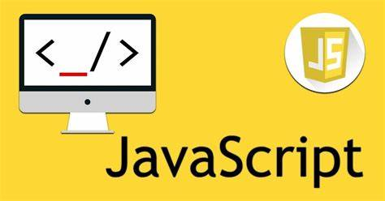

# A Job Listing Application

## About the App
This app is meant to provide a platform for Jobs to be posted (created), for the Job Post to be viewed in detail (read), for a Job Post to be edited (updated), and finally for it to be deleted.

This simple app embodies the full CRUD function of WebApps.

## Who the App is for
Imagine you wanna own a platform that stores information about various Job openings, in other to help people? Then that is the purpose of this app.

## How It Works
The default Home page will Only show the 3 latest jobs, but you can click on 'View All Jobs' to view all Jobs available on the App'
On each of the individual Job posting, click on Read More to view full details about the Job.
And CRUD can happen effectively on each of the Listings.
## BackEnd
I used a Json Server to serve as a Mock Backend server, where information can be stored and retrieved and honestly, I am amazed by the power of the Json server, although, it has a limitation with deployment, I truly achieved primarily what this app is meant for.
With the Json server, I am able to perform CRUD functions like:
- GET (Get Request)
- POST
- PUT
- DELETE

## Technologies used
ReactJs, Javascript, Tailwind CSS and HTML.
.jpeg).jpeg).jpeg)

- Now, this app for Job listings, better posts a Job to me..

Enjoy!